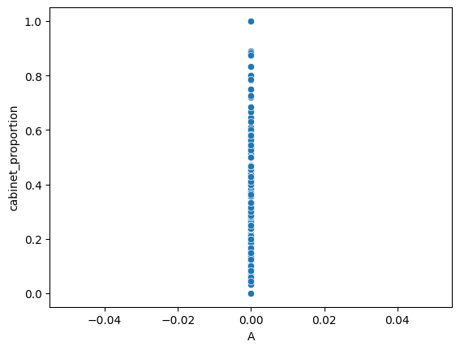

# Modelling Cabinet Ministries Distribution in European Parliamentary Democracies

# 1. Introduction

This paper aims to investigate the amount of cabinet ministries each party gains in European parliamentary democracies, as a ratio to the total amount of democracies. As such, the dependent variable is a ratio from 0 to 1, where 1 means that party is awarded all ministries, and 0 where a party has no ministries.

The data comes from: 

*Government formation as logrolling in high-dimensional issue spaces (Scott de Marchi with Michael Laver). 2020. Journal of Politics.*

*Government Formation in the Shadow of an Uncertain Future Election (Scott de Marchi with Michael Laver and Georg Vanberg). Forthcoming. In Edward Elgar Handbook of Coalition Politics.*

## 1.1 Comments

The models, including their respective interpretations, feature selections, imputation and dropping data points, were made with generalizations based on the Belgian Political System. Therefore, the assumptions of the models and other ideas listed below might be wrong for other European countries.

## 1.2 Preliminary Observations

Before looking at feature names and selection, imputation etc…, we can first clean part of the data in the csv file. The data can be imported as follows:

```python
import pandas as pd
import statsmodels.api as sm

# Read the CSV file into a DataFrame
df = pd.read_csv('cleaned.csv')

# Create a summary table
summary_table = df.describe()
summary_table
```

To find other abnormalities in the data and getting simple information on which variables seem correlated with the independent variable, we can plot a scatter plot of each independent variable with the dependent variable.

```python
import matplotlib.pyplot as plt

# Print a plot of each X variable against the Y variable
for col in X.columns:
    sns.scatterplot(x=X[col], y=y)
    plt.show()
```

Amongst the variables, only one more had an abnormality: `A`. All values are set to 0, which makes sense as there likely hasn’t been a single party that got over 50% of the votes since 1986 (might have happened near the world wars but our data spans from 1986 onwards). We can thus drop `A`.



## 1.2 Data “Cleaning” and Feature Engineering

The following rows can be dropped:

- ******************************“Name” columns******************************
    - `party`, `cabinet_name`, `country`, `party_name`, `party_name_english` can all be dropped as we would like a model that predicts based on other features than the party names (as they are a lot of them, and making dummy variables would be very long for a linear model and a decision tree would have to split a lot of times)
- **********************************************Duplicate rows**********************************************
    - `base` and `state` represent the exact same data.
        - *drop `base`*
    - $\text{seats share} = 100 \times \text{seats proportion}$
        - *drop `seats share`*
    - `election year` and `start date` / `election date` represent roughly the same info where `start date` is approximately two weeks after the `election date`.
        - *drop `start date` / `election date`*
    - $\text{cabinet proportion} = \frac{\text{cabinet seats}}{\text{total cabinet size}}$. As each country has a different `total cabinet size`, we can just keep `cabinet proportion`.
        - *drop `cabinet seats` and `total cabinet size`*
    - $\text{seats proportion} = \frac{\text{seats}}{\text{seats total}}$. Using the same logic as above, we can just keep the first.
        - *drop `seats` and `seats total`*
    - `miw new` and `miw proportion`
        - *drop `miw new`*
    - Furthermore, we can convert 2 columns that have inverse information or very similar information. Those can easily be found using collinearity between variables:

```python
from sklearn.linear_model import Lasso
import seaborn as sns

corr = X.corr()
corr_abs = corr.abs()

# Get the features with the highest multicollinearity
features_with_highest_multicollinearity = corr_abs.unstack().sort_values(ascending=False).drop_duplicates().head(15)

# Remove variables that are correlated to themselves
features_with_highest_multicollinearity = features_with_highest_multicollinearity[features_with_highest_multicollinearity.index.get_level_values(0) != features_with_highest_multicollinearity.index.get_level_values(1)]

# Print the features with the highest multicollinearity
print(features_with_highest_multicollinearity)
```

- This returns:

| Feature 1 | Feature 2 | Absolute Correlation |
| --- | --- | --- |
| seats_total | W | 0.999996 |
| seats_proportion | seats_share | 0.997625 |
| banzhaf | shapley | 0.995847 |
| splus | shapley | 0.994279 |
| shapley | miw_proportion | 0.971328 |
| left_rightx | left_righty | 0.966072  |

- `seats_total` and `W` being so multi colinear makes sense as `W`, the winning threshold, should be equal to $\frac{\text{seats total}}2$ (the rounding is probably what makes $Correlation \neq 1$).
    - *Drop `W`*
- Furthermore, this already gives us insight into PCA’s that we can use, such as an `**ideology PCA**` including `left_right` variables, `**pivotality PCA**` including `splus`, `shapely`, `miw`, and `banzhaf`

- ******************************************************Non informative rows******************************************************
    - `country_id`, `election_id` , `cabinet_id`, `party_id`- *all 4 dropped*
    - `election year` was dropped as it seems irrelevant to predicting the DV, as every year all the DVs in each country add up to 1.
    - `country_dummy`: dropped all 13 of them as we would need to have 13 different models (one for each country)
- **Missing data**
    - drop the `coalition_total` column.
- ****************************************Cabinet related data****************************************
    - Any data related to cabinet should be dropped as we shouldn’t use that year’s information to predict how many ministries the party will win the same year.
        - drop `cabinet_party`, `largest_cab`, `cab_count`

# 2. Feature Selection

Now that the data is cleaned, we can start looking at what the data means and selecting features.

As mentioned above, the dimensionality of the data can be reduced by using PCA as a lot of features representing similar ideas have high multicollinearity. 

Thus, we can apply PCA, or some should be dropped if PCA cannot account for *most* of the variance when reducing the dimensionality. The value of the keyword *most* will depend from feature to feature, but is explained each time.

We thus first standardize the data:

```python
from sklearn.preprocessing import StandardScaler

# Standardize the data
scaler = StandardScaler()
X_standardized = scaler.fit_transform(X)
# Convert the standardized array back to a DataFrame
X_standardized = pd.DataFrame(X_standardized, columns=X.columns)
X_standardized.describe()
```

## 2.1 PCA

Several of the features can be merged by using PCA, to preserve the variance but reducing the features.

This can notably be applied to features that represent the same idea. The following ideas can be looked at:

- ************Pivotality features:************ `splus`, `shapely`, `miw`, and `banzhaf`

```python
# Run a PCA and plot the explained variance ratio
from sklearn.decomposition import PCA
import numpy as np
pca = PCA()
pca.fit(X_standardized[['splus', 'shapley', 'miw_proportion', 'banzhaf']])
# Continue with PCA plot and feature selection

features = range(pca.n_components_)
plt.bar(features, pca.explained_variance_ratio_, alpha=0.5, label='Individual Variance')
plt.plot(features, np.cumsum(pca.explained_variance_ratio_), marker='o', linestyle='-', label='Cumulative Variance')
plt.xlabel('PCA feature')
plt.ylabel('Variance')
plt.xticks(features)
plt.legend()

# Plot the data points
plt.scatter(features, pca.explained_variance_ratio_, c='red', label='Individual Values')
plt.scatter(features, np.cumsum(pca.explained_variance_ratio_), c='blue', label='Cumulative Values')

# Label each data point with its value
for i, var_ratio in enumerate(pca.explained_variance_ratio_):
    plt.text(features[i], var_ratio, f'{var_ratio:.2f}', ha='center', va='bottom')

for i, cum_var_ratio in enumerate(np.cumsum(pca.explained_variance_ratio_)):
    plt.text(features[i], cum_var_ratio, f'{cum_var_ratio:.2f}', ha='center', va='bottom')

plt.legend()
plt.show()
```


Running a PCA, we can see that the PCA feature 0 represents 98% of the variance, which means we can reduce those 4 variables into 1 dimension we can call `pivotalityPCA`.

Although 98% can seem high, due to the high multicollinearity between the variables in the PCA, it isn’t surprising.

```python
# select the PCA feature 0 and add it to X
X['pivotalityPCA'] = pca.transform(X_standardized[['splus', 'shapley', 'miw_proportion', 'banzhaf']])[:, 0]
X.drop(['splus', 'shapley', 'miw_proportion', 'banzhaf'], axis=1, inplace=True)
```

- **Ideology Features**: `left_rightx` `left_righty`

A problem with running a PCA on those variables is that `left_righty` is missing a lot of data. 

My initial idea was to impute based on values of the same parties. However, the values for the same parties change a lot over time( Ex: Schroeder I goes from 2.8 to 6.7). Therefore, as it is highly correlated with `left_rightx` and other variables, we can run K-Nearest Neighbors (KNN) imputation. The amount of nearest neighbors can be chosen based on how many countries appear in the dataset (assuming each country has parties with very distinct `left_righty` values, imputing based on the $k-1$ other countries most similar parties makes sense). Therefore, we can set it to

$$
\text{n neighbors} = 13 -1 = 12
$$

My code is thus:

```docker
import numpy as np
from sklearn.impute import KNNImputer

# Drop any rows with missing values (except for the left_righty column which we are going to impute for)
X.dropna(subset=X.columns.difference(['left_righty']), inplace=True)

imputer = KNNImputer(n_neighbors=12)
# Impute the missing values and create a new DataFrame with the imputed data
X = pd.DataFrame(imputer.fit_transform(X), columns=X.columns)

X.describe()
```


Then, we can run a PCA again.

*(Same code as above but with different features, standardizing again before running the PCA)*

Running the PCA, we can see that the PCA feature 0 represents 98% of the variance. As explained above, that is enough.

After running this PCA, I realized it might have been easier to just DROP `left_righty` . This wouldn’t have had a massive impact on the models in the future because of how multicollinear `left rightx` and `left righty` were, as well as left righty having a lot of missing data

```python
# select the PCA feature 0 and add it to X
X['ideologyPCA'] = pca.transform(X_standardized[['left_rightx', 'left_righty']])[:, 0]
X.drop(['left_rightx', 'left_righty'], axis=1, inplace=True)For the same reason as above, we can reduce it to one dimension. 
```

We are now at **21** columns. 

## 2.2 VIF

After running PCA’s and dropping preliminary features, we can check if VIF is elevated in order to make sure we got rid of all multicollinearity.

```python
from statsmodels.stats.outliers_influence import variance_inflation_factor

# Calculate VIF for each feature
vif = pd.DataFrame()
Xvif = X.drop([target], axis=1)
vif["Feature"] = Xvif.columns
vif["VIF"] = [variance_inflation_factor(Xvif.values, i) for i in range(Xvif.shape[1])]

# Print the VIF values sorted from greatest to smallest
vif.sort_values(by='VIF', ascending=False)

print(vif)
```

Compared to the last model I ran on political data in US politics, the VIF of variables are considerably, with only the party system binary variables reaching the double digits - E has the highest VIF, of 33 (probably correlated to Caretaker and other variables highlighting the current government staying in charge). Our PCA was thus successful.

# 3. Running models

Before running models, an interesting observation when plotting a histogram of the dependent variable is that it is highly 0 inflated, as seen on the right. We thus **expect** decision tree models to do better than linear regressions, except if the linear models are somehow split into 2 different models.

However, this also means that for a model to be considered decent, it should have a higher $R^2$ compared to usual.


This is because setting the prediction to $y = 0$ would be correct more than 50% off the time. Therefore, we need to keep that in mind when judging our models.

```python
# try to find the MSE of a model that predicts 0 for every observation
from sklearn.metrics import mean_squared_error
y_pred = [0] * len(y)
mse = mean_squared_error(y, y_pred)
print("MSE of predicting 0 for every observation:", mse)
```

$\text{MSE of predicting 0 for every observation: }0.07405019195871358$

## 3.1 Preliminary Model: XGBoost

In order to have a better idea of the achievable $R^2$ value for our model, we can run an XGBoost regression model. 

Our chosen hyperparameters are as follows:

- `learning_rate` : as the default is $0.1$, we can start with that and take smaller learning rates which take more time to boost but can result in better generalization:
    
    $$
    \text{learning rate} = [0.01, 0.05, 0.1]
    $$
    
- `max_depth` : The max depth of the tree should be small enough so the model is interpretable when running a normal decision tree. Anything above a depth of 4 has 62 or more splits, which makes it very long and difficult to interpret.

$$
\text{max depth} = [2,3,4]
$$

- `n_estimators` : We can use a large amount of trees as runtime is not really a problem for this assignment, while using `early_stopping_rounds` in order to stop the program slightly quicker if there is no improvement

$$
\text{n estimators} = [1000] \\
\text{early stopping rounds} = [100]
$$

- A train test split will also be used to check our model’s Out of Sample MSE. The size of our test split has to be slightly bigger than my previous model on a=American politics as the dataset is smaller, and over/under fitting to the test size is a concern. Leaving it at the default size of 0.2 should work.

$$
\text{test size}=0.2
$$

- Finally, we can use `k-fold` to cross validate. As mentioned before, run time isn’t a problem, and the dataset is moderately large. We can thus use a k-fold value of around 10

$$
\text{cv} = 10
$$

```python
grid_search = GridSearchCV(estimator=xgb_model, param_grid=param_grid, scoring='r2', cv=10)
```

`Objective` can be left as the default, and `verbosity` will be set to 2 so we can see what the model is doing (just printing more information).

Note: This code may take a long time to run, so Google CoLab [https://colab.google/](https://colab.google/) can be used. Verbose can be set to 0 to increase speed and decrease memory usage (printing each model’s performance takes a lot of time and space).

```
from sklearn.model_selection import train_test_split, GridSearchCV
from sklearn.metrics import r2_score
from xgboost import XGBRegressor 

from sklearn.tree import DecisionTreeRegressor
from sklearn.model_selection import cross_val_score
from sklearn.model_selection import GridSearchCV

y = X[target]
X.drop([target], axis=1, inplace=True)
X_train, X_test, y_train, y_test = train_test_split(X, y, test_size=0.2, random_state=10)
```

We can set the random state to an arbitrary value, such as 10 above, and re-run all models with a different random state, such as 20, to make sure we didn’t get “lucky”.

```python
param_grid = {
    'learning_rate': [0.01, 0.05, 0.1],
    'max_depth': [2, 3, 4],
    'n_estimators': [500,1000,2000],
    'early_stopping_rounds': [100],
    'verbosity': [2],
}
```

```python
# Define the XGBoost regressor (use XGBRegressor for regression tasks)
xgb_model = XGBRegressor()

# Initialize GridSearchCV
grid_search = GridSearchCV(estimator=xgb_model, param_grid=param_grid, scoring='neg_mean_squared_error', cv=10)
grid_search.fit(X_train, y_train, eval_set=[(X_test, y_test)], verbose=0)

# Get the best parameters from the grid search
best_params = grid_search.best_params_

# Create an XGBoost model with the best parameters
best_xgb_model = XGBRegressor(**best_params)

# Fit the model to the training data with a validation dataset
best_xgb_model.fit(X_train, y_train, eval_set=[(X_test, y_test)], early_stopping_rounds=100, verbose=0)

# Make predictions on the test set
y_pred = best_xgb_model.predict(X_test)

# Evaluate the model using R-squared
r2 = r2_score(y_test, y_pred)
print("OOS R-squared Score:", r2)
print("Best Hyperparameters:", best_params)
print("OOS MSE:", -grid_search.best_score_)

y_pred = best_xgb_model.predict(X_train)
r22 = r2_score(y_train, y_pred)
print("In Sample R-squared Score:", r22)
```

We get the following result:

$$
\text{OOS } R^2 \text{ Score: } 0.762124024076923\\
\text{In Sample } R^2 \text{ Score:  } 0.8512304143893161 \\
\text{Best Hyperparameters: [learning rate: 0.01, max depth: 3, n estimators: 1000]} \\
\text{OOS MSE: } 0.01696820532795456
$$

This shows the model slightly overfits to the training data. Adding hyperparameters such as even smaller learning rates and a higher $\text{n estimators}$ might help make a more accurate XGBoost model if prediction was our goal. However, as we are looking for interpretability for this particular assessment, this is enough evidence that we can achieve a high performance model using a decision tree of depth 3.

Changing the random state, we get

$$
\text{OOS } R^2 \text{ Score: } 0.7329330071678797\\
\text{In Sample } R^2 \text{ Score:  } 0.838793560046194 \\
\text{OOS MSE: } 0.01564926388046726
$$

The two results are similar, showing that this can be replicated.

## 3.2 Decision Tree

Knowing that a very high $R^2$ value is achievable for our model using a max depth of 3, we can run a simpler Decision Tree, using k-fold cross validation and pruning.

Setting all the parameters identically to the XGBoost, we can add a range of values for the penalty coefficient - alpha - for the pruning:

$$
alphas = [0.0001, 0.001, 0.01, 0.1, 1, 10]
$$

Simply with a model of max-depth 2, we can already achieve an $R^2$ of around $.65$ .


$$
\text{OOS } R^2 \text{ Score: } 0.6486\\
\text{In Sample } R^2 \text{ Score:  } 0.70166 \\
\text{OOS MSE: } 0.019908\\
\text{Best Alpha after CV: } 0.0001
$$

There is still a bit of overfitting but, it is a decently good model and very interpretable. The story of this model is that:

- Having the Prime Minister originate from your party automatically secures a large (near majority) amount of ministries. This makes sense, and can be attributed to 2 reasons:
    - Usually, the prime minister originates from large parties as those are the most helpful in helping someone get elected, by funding or spreading campaign information. Therefore, if your party has the prime minister, it likely means you have a large amount of seats at the parliament and thus are more likely to have a higher proportion of cabinets awarded to you.
    - Furthermore, in some countries, the prime minister directly gets to decide the distribution of ministries (along certain agreements made between the parties in the coalition). Having them originate from your party is thus a massive boost.
- The distribution is also dependent of the pivotality of the PCA. We are likely to think that it is based on the relative size of the parties in the coalition (such as the most seats in Parliament), but in reality, it also depends on other factors.
    - For example, let us say the distribution of seats at the Parliament is as follows: Party A has 8 seats, Party B also has 8 seats, and Party C has 2 seats. Each party needs to form a coalition to be able to get a majority - in this case, every party has the same pivotality as any coalition of two parties secures a majority. Party A and Party B might be inclined to form a coalition with Party C as then they could try to get more ministries than Party C by saying that they deserve more because they are larger - however, a credible threat of Party C is to go to the other Party if they do not get a fair amount of ministries. Party A and B would try to avoid going together as they’d have to split with an equally big party. Therefore, although Party C is a lot smaller than the two others, it definitely does not have a lot less power than them.

Our tree is thus very interpretable and aligns with what we would expect. We could try to use a max depth of 3 to observe how much the model can improve.


$$
\text{OOS } R^2 \text{ Score: } 0.66259\\
\text{In Sample } R^2 \text{ Score:  } 0.01749 \\
\text{OOS MSE: } 0.74193\\
\text{Best Alpha after CV: } 0.0001
$$

As we can see, the  $R^2$ slightly improves with 4 extra splits. However, as interpretability considerably decreases, we will **keep the tree with a depth of 2** which is a lot easier to interpret.

```python
dtree = DecisionTreeRegressor()

# Define a range of alpha values for pruning
alphas = [0.0001, 0.001, 0.01, 0.1, 1, 10]
param_grid = {'ccp_alpha': alphas, 'max_depth': [2,3]}

# Perform grid search with cross-validation
grid_search = GridSearchCV(dtree, param_grid=param_grid, scoring='neg_mean_squared_error',cv=10)
grid_search.fit(X_train, y_train)
best_dtree = grid_search.best_estimator_

y_pred = best_dtree.predict(X_test)
r2 = r2_score(y_test, y_pred)
print("Out of Sample R-squared Score:", r2)
print("Best Hyperparameters:", grid_search.best_params_)
print("Out of Sample MSE:", -grid_search.best_score_)

y_pred = best_dtree.predict(X_train)
r22 = r2_score(y_train, y_pred)
print("In Sample R-squared Score:", r22)

from sklearn.tree import plot_tree
import matplotlib.pyplot as plt

# Plot the decision tree
plt.figure(figsize=(12, 8))
plot_tree(best_dtree, feature_names=X.columns, filled=True)
plt.show()
```

## 3.2 Lasso Regression

We can run a Lasso Regression to see what features we can drop.

First, let us plot a lasso chart with the x-axis representing the penalty function, and the y-axis representing the features, as to observe them drop to 0. The range of alpha values can be adjusted based on if we can see variables get dropped in the current window. I ended up with a final window of $10^{-4} \text{ to } 10^1$. (We can leave it as bigger in the code, and just reduce the window to what interests us using `plt.axis('tight')`. I also reduced the y-axis so watching the features drop was easier.

```python
# Set a range of alpha values
alphas = np.logspace(-4, 1, 30)

# Standardize the data
scaler = StandardScaler()
X_standardized = scaler.fit_transform(X)
# Convert the standardized array back to a DataFrame
X_standardized = pd.DataFrame(X_standardized, columns=X.columns)
X_standardized.describe()

# Initialize an empty list to store coefficients for each alpha
coefs = []
colors = ['blue', 'orange', 'green', 'red', 'purple', 'brown', 'pink', 'gray', 'olive', 'cyan', 'magenta', 'yellow', 'teal', 'navy', 'lime', 'maroon', 'aqua', 'silver', 'fuchsia', 'gold']

# Fit Lasso regression for each alpha and store coefficients
for alpha in alphas:
    lasso = Lasso(alpha=alpha)
    lasso.fit(X_standardized, y)
    coefs.append(lasso.coef_)

# Plot the results
plt.figure(figsize=(20, 6))

ax = plt.gca()
lines = ax.plot(alphas, coefs)
ax.set_xscale('log')
plt.xlabel('alpha')
plt.ylabel('coefficients')
plt.title('Lasso coefficients as a function of the regularization')
plt.axis('tight')

# Assign different colors to the lines representing each feature
for i, line in enumerate(lines):
    line.set_color(colors[i % len(colors)])

plt.legend(X.columns, loc='right')
plt.ylim([-0.05, 0.05])

plt.show()
```


The chart shows that the variables that get dropped first. As the colors are difficult to differentiate, we can just manually print the variables in the order that they get dropped.

```python
zero_variables = []
seen_variable = []
for i, coef in enumerate(coefs):
    zero_indices = np.where(coef == 0)[0]
    zero_variables.extend(X2.columns[zero_indices])

# Print the variables in the order that they reach 0
for variable in zero_variables:
    if variable not in seen_variable:
        seen_variable.append(variable)
        print(variable)
```

The variables that get dropped the latest are `seats_proportion` ,`sq_cabinet`, `prime_minister`, `pivotalityPCA`

## 3.3 Linear Regression

We can plot those 4 variables against the independent variable to observe any patters:


The relationship between `prime_minister` and the `cabinet_proportion` is obvious. The relationship between `pivotalityPCA` and `seats_proportion` to the dependent variable is also visible, although a large amount of heteroscedasticity is present. The relationship with `sq_cabinet` however is unclear.

Running a linear regression with the remaining variables and adding a constant variable (with a `kfold` of  $10$and a `test size` of $0.2$ as explained for the XGBoost), we get the following model. ****(Rounded to 3 decimal places for simplicity)****

$\text{Out-of-Sample }R^2: 0.662\\
\text{In Sample }R^2:0.686\\
\text{Mean Squared Error: }0.0168\\
\text{cabinet proportion} = 0.089 \text{ PivoltalityPCA} + 0.110 \text{ prime minister} + 0.020 \text{ sq cabinet} +0.006 \text{ seats proportion}$

```python
X2 = X_standardized[['pivotalityPCA', 'prime_minister', 'sq_cabinet', 'seats_proportion']]
X_train, X_test, y_train, y_test = train_test_split(X, y, test_size=0.2, random_state=10)
X2 = sm.add_constant(X2)

from sklearn.linear_model import LinearRegression
from sklearn.metrics import r2_score, mean_squared_error
from sklearn.model_selection import KFold

n_folds = 10

# Initialize an empty list to store the R-squared scores
r2_scores = []

# Initialize an empty list to store the MSE scores
mse_scores = []

# Initialize an empty list to store the model coefficients
coefficients = []

# Create a KFold object
kf = KFold(n_splits=n_folds, shuffle=True)

# Perform k-fold cross-validation
for train_index, test_index in kf.split(X2):
    X_train_fold, X_test_fold = X2.iloc[train_index], X2.iloc[test_index]
    y_train_fold, y_test_fold = y.iloc[train_index], y.iloc[test_index]

    # Add the constant term to the training data
    X_train_fold = sm.add_constant(X_train_fold)

    # Create a linear regression model
    linear_model = LinearRegression()

    # Fit the model to the training data
    linear_model.fit(X_train_fold, y_train_fold)

    # Add the constant term to the test data
    X_test_fold = sm.add_constant(X_test_fold)

    # Predict the target variable for the test data
    y_pred_fold = linear_model.predict(X_test_fold)

    # Calculate the R-squared score for the fold
    r2_fold = r2_score(y_test_fold, y_pred_fold)

    # Calculate the MSE for the fold
    mse_fold = mean_squared_error(y_test_fold, y_pred_fold)

    # Store the R-squared score and MSE for the fold
    r2_scores.append(r2_fold)
    mse_scores.append(mse_fold)

    # Store the model coefficients
    coefficients.append(linear_model.coef_)

# Calculate the average R-squared score and MSE across all folds
avg_r2_score = np.mean(r2_scores)
avg_mse_score = np.mean(mse_scores)

# Print the average R-squared score and MSE
print("Average R-squared score:", avg_r2_score)
print("Average Mean Squared Error:", avg_mse_score)

# Get the feature names
feature_names = X2.columns

# Initialize an empty list to store the average coefficients
avg_coefficients = []

# Calculate the average coefficient for each feature across all folds
for i in range(len(feature_names)):
    avg_coefficient = np.mean([coefficients[j][i] for j in range(n_folds)])
    avg_coefficients.append(avg_coefficient)

# Create the model string
model_string = "cabinet proportion = "
for i, feature in enumerate(feature_names):
    model_string += f"{avg_coefficients[i]:.3f}{feature} + "
model_string = model_string[:-3]  # Remove the last " + "

print(model_string)
```

It is actually surprising that the linear regression model performs equally as well as the decision tree as heteroscedasticity is present - in this case, it even does slightly better. We would expect the decision tree to be able to handle that better. Maybe a more accurate comparison would be a decision tree of depth 3 - which indeed does better, and uses around the same amount of variables as this linear regression.

An interesting observation however is that the decision tree and the linear model use very similar variables: the two main ones in both models are the `prime minister` variable and the `pivotalityPCA` that we ran.

The same interpretation can be made for these two variables as the decision tree but the linear regression also adds some more information:

- a party is more likely to get more ministries if it was part of the winning coalition the previous year. I actually expected the opposite, as often, populations dislike parties that are currently in charge. Why these variable was kept seems to be intriguing as there is no apparent correlation visible on the scatter plot.
- It also includes seats proportion, which makes sense as even in the example I gave above with Party A, B, and C, the first two are more likely to get more ministries even if C has credible threats, mainly due to the fact that there are a lot more parties in a country and Party A and B could just go to another party that would ask for “less” ministries. Having a lot of seats in parliament still highlights power.

# 4. Conclusion

Based on our models, we can quite confidently conclude the following:

- Having the Prime Minister originate from your party automatically secures a large amount of ministries
- Pivotality plays a massive role as it highlights how coalitions are likely to distribute ministries within themselves
- Being in the winning coalition the previous year helps being in the winning coalition of future years as well
- Seats proportion, which give information about the power of parties, has a linear positive relationship with the proportion of ministries that party will gain.

A problem with our models, however, is that most variables highlight how ministries will be split amongst the winning coalition, but do not help massively at identifying how likely a party is to be part of the winning coalition: only pivotality and `sq_cabinet` give slight information about this.

Taking this into account and running two different linear models, or adding an extra split in our decision trees could have helped, as it would have taken care of the heteroscedasticity issues as well.